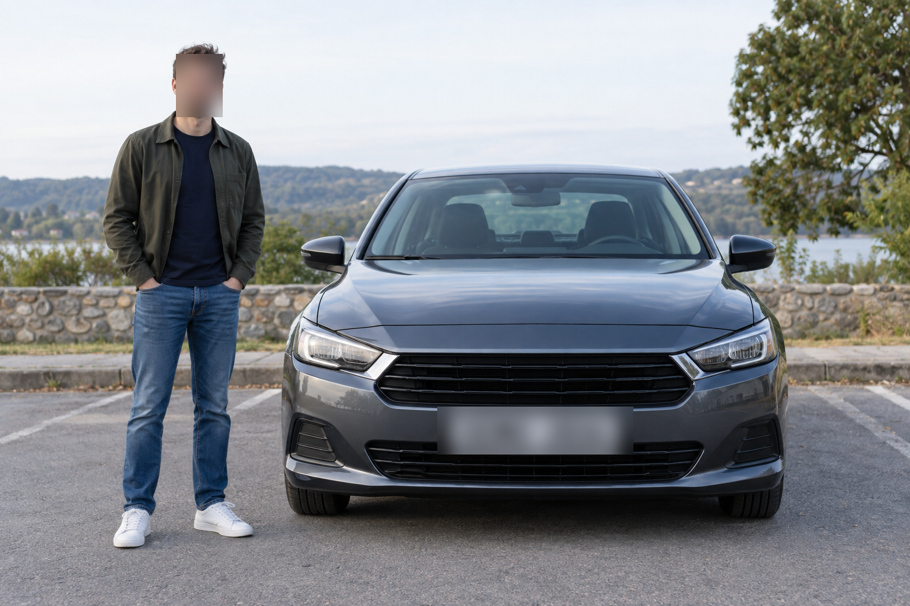

# OneTech Studio · veri maskeleme demosu

Bitirme projesi için maskeleme çalışma alanı. OneTech Chrome eklentisi AI sitelerine gönderilecek istemleri denetler; Streamlit arayüzü aynı metin kurallarını ve fotoğraf, PDF, kısa video maskelemesini sunar.

**[Canlı demoyu aç](https://onetech-studio-maskeleme.streamlit.app/)** · **[Örneklerle dene](#demo-akışı)** · **[Prompt değerlendirmesi](PROMPT_DEGERLENDIRME.md)**



*Sentetik örnekte yüz ve plaka blur çıktısı. Gizli içerik için aşağıdaki yöntem ve sınırları okuyun.*

## Çevrimiçi demo

**Canlı demo:** https://onetech-studio-maskeleme.streamlit.app/  
**Kaynak kod:** https://github.com/aahmetggungor/onetech-studio-maskeleme

Bu depo Streamlit Community Cloud'da `app.py` giriş dosyasıyla yayınlanabilir. Çevrimiçi arayüze yazılan metin ve yüklenen dosyalar sunucuda işlenir; gerçek kişisel/gizli veri yerine yalnızca sentetik örnek kullanın. Özel prompt kuralları çevrimiçi demoda ziyaretçi oturumuna özeldir. Chrome eklentisi çevrimiçi sunucuya bağlanmaz; gizli istemleri korumak için eklentiyi ve API'yi kendi bilgisayarınızda çalıştırın.

## Çalıştırma

Depoyu indirdiğiniz klasörde PowerShell açıp Python 3.12 ortamı kurun:

```powershell
py -3.12 -m venv .venv
.\.venv\Scripts\python.exe -m pip install -r requirements.txt
.\start_local.ps1
```

Başlatıcı, stüdyoyu `http://127.0.0.1:8501` ve eklentinin yerel API'sini `http://127.0.0.1:8765` adresinde açar. İkisi de yalnızca bu bilgisayarın loopback arayüzüne bağlanır.

## Chrome eklentisi

1. Chrome'da `chrome://extensions` adresini açın ve **Geliştirici modu**nu etkinleştirin.
2. **Paketlenmemiş öğe yükle** ile bu deponun `extension` klasörünü seçin.
3. Başlatıcı çalışırken ChatGPT, Gemini veya Claude üzerinde sentetik bilgi içeren bir istem gönderin. Eklenti, eşleşmeleri gönderimden önce gösterir. Yerel servis kapalıysa gönderim durdurulur.
4. Yerel stüdyonun **Prompt koruması** sekmesinde aynı kuralları deneyin ve özel ifadeler ekleyin.

Metin tespiti e-posta, telefon, doğrulanmış T.C. kimlik/IBAN, Luhn doğrulamalı kart, belirli API anahtarı kalıpları, etiketli ad soyad ve özel ifadelere dayanır. Serbest kişi/kurum adı için AI modeli henüz yoktur. Eklenti sitelerin HTML düzenine bağlı olduğu için hedef sitelerde ayrıca elle kontrol gerektirir. Yerel kurulumda kaynak istem ve dosyalar uzak API'ye gönderilmez. Önceki OneTech Node sunucusu ve GitHub Pages paneli bu sürümün çalışma akışında kullanılmaz.

## Demo akışı

`examples/` dosyaları uydurma bilgiler içerir.

1. **Prompt:** Örnek istemi inceleyip bulunan e-posta ve telefonu maskeleyin. Özel kural ekleyip eklentide deneyin.
2. **Fotoğraf:** `ornek_yuz_plaka.png` yükleyin. Yüz ve plaka kutularını kontrol edin; varsayılan yoğun blur ile önce/sonra görüntüyü karşılaştırıp PNG indirin. Hazır çıktı: `ornek_yuz_plaka_blur.png`.
3. **Belge fotoğrafı:** `ornek_belge.png` yükleyin. OCR adaylarını düzeltip çıktı alın.
4. **PDF:** `ornek_belge.pdf` ve `ornek_taranmis_belge.pdf` ile metin katmanı/OCR akışlarını ayrı ayrı gösterin.
5. **Video:** `ornek_video.mp4` yükleyip kısa MP4 çıktısı üretin. Bir karede kaçırılan yüz/plaka için iki kareye kadar takip desteğini açıp kapatabilirsiniz. Maske bulunmayan karelerin zamanlarını çıktı altında inceleyin.

## Yöntem ve sınırlar

| Alan | Yöntem |
| --- | --- |
| Yüz | OpenCV YuNet |
| Plaka | YOLOv9 ONNX, Open Image Models |
| Belge metni | PDF metin katmanı veya RapidOCR Latin |
| Prompt | Yerel regex/doğrulama kuralları ve özel ifadeler |
| Maskeleme | Yoğun blur, siyah kapatma, pikselleştirme; PDF için siyah kapatma |

PDF maskelenmiş sayfa piksellerinden yeniden kurulur; orijinal metin katmanı ve metadata taşınmaz, metin seçme/arama kaybolur. Video ilk 12 saniye, en fazla 8 FPS ve 960 piksel genişlikte işlenir; ses çıkarılır. Her karede yüz/plaka algılanır. İsteğe bağlı ViTTrack takibi, kaçırılan alanı en fazla iki sonraki karede maskelemeyi dener. Takip de alan kaçırabilir; arayüz maskesiz kare sayısını ve zamanlarını gösterir. Blur görsel sunum için kullanılır; kesin gizleme gereken içerikte siyah kapatma seçin. Algılayıcı ve OCR alan kaçırabilir; çıktıyı indirmeden önce görsel olarak inceleyin. Prompt kurallarının küçük sentetik ölçümü [PROMPT_DEGERLENDIRME.md](PROMPT_DEGERLENDIRME.md) içinde.

Kod: `app.py` arayüz, `core.py` görüntü maskeleme, `detectors.py` AI/OCR, `documents.py` PDF, `video.py` MP4, `temporal.py` kareler arası takip, `prompt_guard.py` ortak prompt kuralları, `prompt_api.py` yerel eklenti API'si, `extension/` Chrome eklentisi. Yeni bilgisayarda takip modeli eksikse `.\.venv\Scripts\python.exe download_tracker.py` komutuyla indirilip doğrulanır.

Doğrulama:

```powershell
.\.venv\Scripts\python.exe verify_demo.py
.\.venv\Scripts\python.exe verify_prompt.py
.\.venv\Scripts\python.exe evaluate_prompt.py
node .\extension\verify_local.js
```

Hazır modeller: [OpenCV Zoo YuNet](https://github.com/opencv/opencv_zoo/tree/main/models/face_detection_yunet) (MIT), [OpenCV Zoo ViTTrack](https://github.com/opencv/opencv_zoo/tree/main/models/object_tracking_vittrack) (Apache-2.0), [Open Image Models](https://github.com/ankandrew/open-image-models) plaka modeli (MIT), [RapidOCR](https://github.com/RapidAI/RapidOCR) (Apache-2.0), [PyMuPDF](https://pymupdf.readthedocs.io/en/latest/) PDF işlemleri. Model eğitimi veya ölçülmüş Türk plaka başarımı iddia edilmez.
